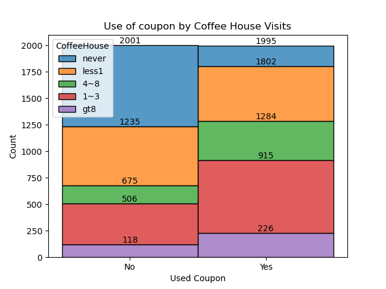

# Will the Customer Accept the Coupon?

[Link to notebook here](prompt.ipynb)

An analysis of a data set with a report detailing my findings.

## Purpose
The purpose of this project is to determine an effective demographic group to target for coupon marketing.
### Assumptions
We must assume that coupon marketing has a cost associated with it, otherwise this project has no point. 

A lower budget is better, so long as it generates a relatively higher return. A return in this case would be a customer using the coupon, denoted as "Y" in the data source.

## Findings

### Section One: Bar Coupons
In the first section, we investigate bar coupons. Our research involves discovering the most effective use for our couponing budget, by optimising which groups we market these coupons to. Our findings are as follows:

1. The most likely people to accept a coupon and use it are those who regularly go to the bar anyways. Those who visited the bar more than 4 times monthly were the greatest proportion of coupon acceptants.

2. Those over the age of 25 were also more likely to visit bars.

3. Those without children in their vehicles were also more likely to visit bars when recieving coupons, especially if they did not work in farming, forestry, or fishing.

4. To a lesser extent, widows and the separated also seemed more likely to visit bars. (Leftmost Graph)

### Section Two: Coffeehouse Coupons

In the second section, we perform an independent investigation on coffee shop coupons. Our findings are follows:

1. People who visited the coffee shops more often were more likely to use the coupon as compared to those who visited less often.

2. People who lived between 5 and 15 minutes from the coffee shop were more likely to accept the coupons. (Top right and bottom left)
3. People were more likely to accept and use the coupons on days where the weather was around 80 degrees farenheit and sunny (Bottom right).

4. People were much more likely to accept the coupons around 10AM, and still more likely than average around 2PM.(Top Left)
5. People under the age of 26 were more likely than average to accept the coupons. (Top Right)

There are undoubtedly more pieces of information that can be gleaned from the given charts, but these appear to be the most useful. I have combined several of these categories to give an example of a small but effective group to market to. About two thirds of this group will respond positively to a coupon delivery, optimizing the costs associated with said coupons.

## Next Steps

The point of these next steps would be to spend the least amount on marketing coupons to generate the most number of customers. This again relies on the assumption that sending the coupons to customers has some sort of cost associated with it. In the case that the coupons are free, the best possible thing to do is to send it to every single person available, focusing on simply the largest groups of people who accepted and used the coupons.

The ideal next steps based on this report would be to:

1. Calculate the cost per successful coupon delivery for previous marketing attempts.
2. Use the now generated number to determine the maximum number of purchasable coupons.
3. Use this number to deliver the optimal ratio of coupons purchased to coupons used.

